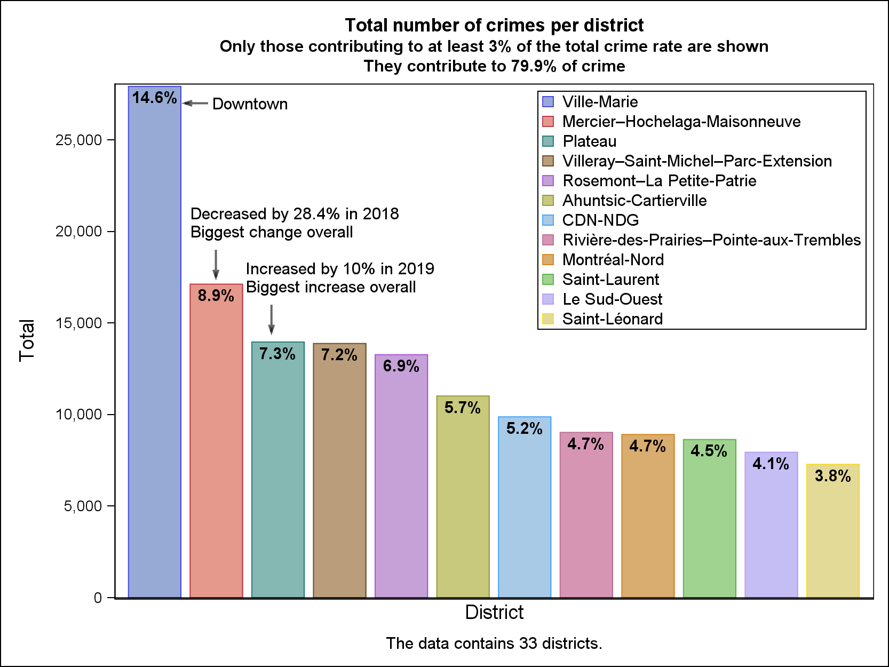

# Montreal Crime Study
 Analyzing the changes in crime trends over years using the publicly available dataset of criminal acts on the city's open data portal. Auto Burglary is the most alarming crime category. Mercier-Hochelaga-Maisonneuve experienced a big decrease in crime rate by 26.4% in 2018 while the plateau had the biggest increase among all districts by 10% in 2019. The crime rate peaks in October and achieves its minimum in February. Most crime categories are exhibiting a decreasing trend except for auto theft and fatal crimes which have an increasing trend.  
 
 **Please check the full report on Medium.com https://medium.com/@khaledsfouda/montreal-crime-study-e64f75bf0b3f** 
   
 In this repo you can find source code, data, and generated plots.   
 Methodology is explained below.  
 
 -------------------
 
 ## Methodology
 ### Data Cleaning
 
 Data cleaning was done in R and the source code files can be found under the directory /src_R.    
 Districts weren’t provided in the original dataset. To get them, we used OpenStreetMap’s API to get the nearest full residential addresses to location coordinates. We then applied several string manipulation techniques to extract the districts. We were able to narrow them down to 33 distinct district and cover 97% of the data.  

The file OSM_SEARCH.R Converting location coordinates into complete addresses and saves them to the directory /data/processing.   
The file Data_Cleaning.R does the cleaning. It uses the addresses produced by OSM_SEARCH.R to extract districts.  
The final processed data is saved to /data/output/Police_Interventions_cleaned.csv.  
Moreover, extra timeseries tables are saved as  /data/output/ts_all_CATEGORIES.csv, /data/output/ts_[category] where [category] is replaced by each category name.  

**The rest of the project is done in SAS programming language and the source code can be found under /src_SAS**
### Data preparation
 PROC FREQ and PROC SORT were applied before all visualizations. PROC SQL, TRANSPOSE, and TIMESERIES were also useful to prepare the data further analysis.  
### Visualization
We had two ways to produce graphs:  
- PROC SGPLOT and SGPANEL along with annotations, legends and axes parameters.  
- PROC TEMPLATE and using PROC SGRENDER to render the templates.  
Seasonal Subseries plot:  
- SAS doesn’t provide a direct way to produce them. We produced individual spline fit graphs for each month and exported them to images without borders or axes. We then used these images as labels for a final scatter plot combining them all where the y-axis represents the mean value for that month,  
### Time Series Model
- PROC UCM (Unobserved Component Models) allowed us to define model components as well as ARMA and differencing parameters.  
- We attempted several combinations of ARMA parameters between 0 and 2 to find the best fit for each model. (one model per category).  
Model Proposal:
- Differencing at lags 1 (trend) and 12 (seasonality)
- Choose AR and MA orders that scores the lowest on AICc and are at least 95% significant. AICc has more priority than significance.
**Model fit and output graphs are under /plots/SAS/timeseries**  
 An example of model fit for one of the categories is shown below   
 
   
 ### SAS code files
 - Read_data.sas *to read the csv file, convert it to a permenant sas-data-file with the write data-types and labels. A sample output is printed to screen with the option of saving it as a local image. Data is saved to /data/sas and the sample image is saved to /plots/SAS/EDA*   
 -  Exploratory_Analysis.sas *does the EDA while printing/saving interetesting plots. plots are saved to /plots/SAS/EDA*  
 -  monthplot.sas monthplot_MACROS.sas timeseries_analysis.sas *produces the seasonal plots found in /plots/SAS/monthplot. The first two files holds important macro functions and the third file calls those functions to produce the plots*  
 -  timeseries_model.sas *fits a timeseries model for each of the category. Model fits and plots are saved to /plots/SAS/timeseries.*  

-------------  

## References  

- Actes criminels - Dataset (montreal.ca) 
https://donnees.montreal.ca/ville-de-montreal/actes-criminels  
- Identifying Seasonality and Trend with a Cycle Plot in SAS® by Lingxiao Li, SAS Institute Inc
https://support.sas.com/rnd/datavisualization/papers/sgf2019/3214_2019.pdf  

------------------
